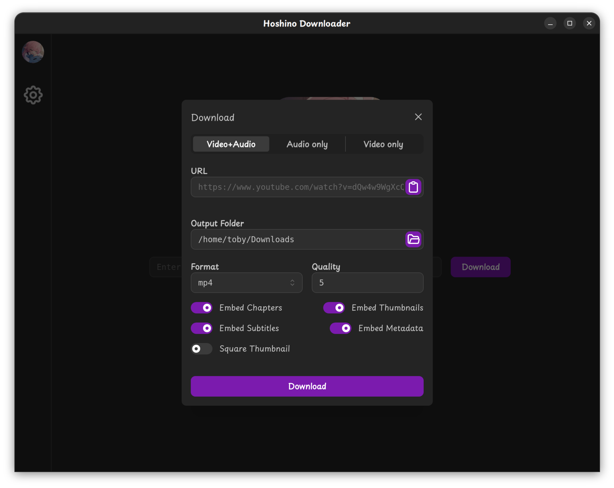

# Hoshino Downloader

downloading a YouTube video in 2026 has been hell

## Dependencies

- [Go 1.25+](https://go.dev/)
- [Wails](https://wails.io/)
- [Bun](https://bun.sh/)

## Live Development

Run `wails dev` in the project directory

If you are on Linux and it complains about WebKit, add `-tags webkit2_41` to the command. (eg. `wails dev -tags webkit2_41`)

## Building

Run `wails build` in the project directory.

If you are on Linux and it complains about WebKit, add `-tags webkit2_41` to the command. (eg. `wails build -tags webkit2_41`)

Add `-upx` to compress the final executable. (Windows and Linux only)

Add `-platform <platform>` to cross-compile for a specific platform.

## TODO

- Queue
- Progress
- Update tools
- Default Settings
